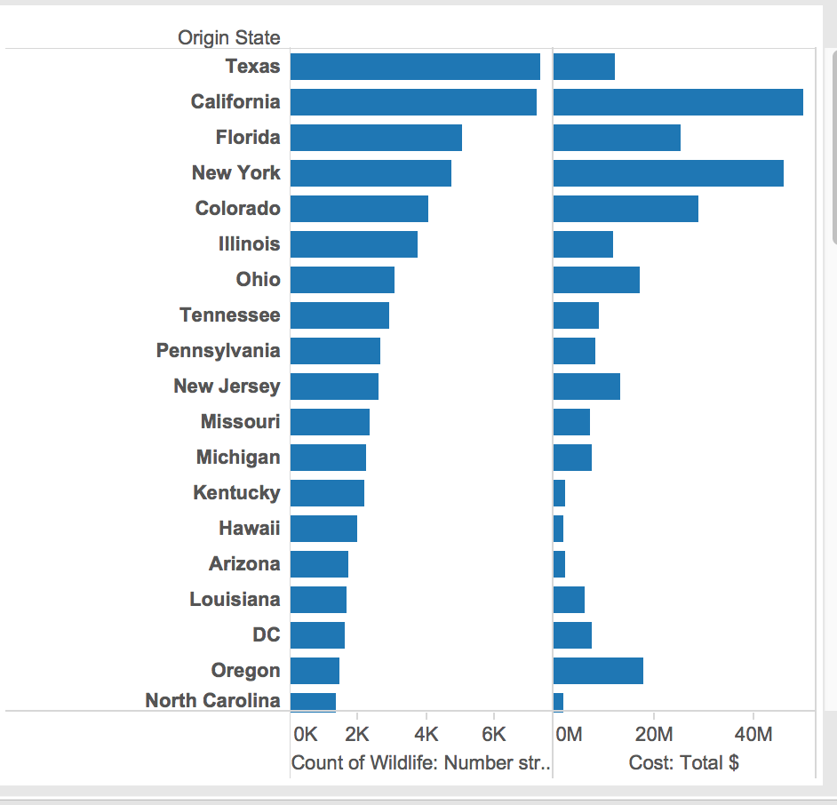

# Report

Using Tableau, create visualization for each question in the report regarding
bird strikes.

# Authors

This report is prepared by
* [Caleb Hsu](https://github.com/calebhsu/)
* [Andrew Linenfelser](https://github.com/Linenfelser)
* [Zhili Yang](https://github.com/zhya215)
* [Andrey Shprengel](https://github.com/AndreyShprengel)
* [Andrew Berumen](https://github.com/anbe6083)

# What type of aircraft has the most instances of damaged caused by bird strikes? (nicolele).

Airplane is the type with the most instances of damaged caused.

# What are the top 5 bird species that are involved? (ZachLamb)

The largest bubbles indicate the greatest number of occurences of a particular species in the birdstrike. The number below each species indicates the average cost in hours incurred by said species.

# What is the most common flight phase where a birdstrike occurred?(KevinKGifford)

(This is a pie chart the represents what portion of the birdstrikes happened during each phase.
The legend in on the right the most common was approach)

# How many flights have been cancelled by birdstrikes? (pail4944)

The graph indicates the number of occurrences and the type of cancellation that occured.

# What states cost the airlines the most money? (Cost and location) asked by willzfarmer, answered by Andrew Berumen

I graphed the number of bird strikes according to origin state, along with the sum of total costs of damage due to birdstrikes  
