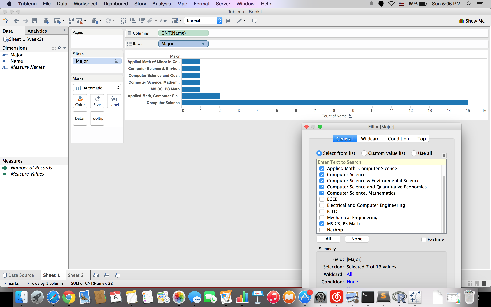
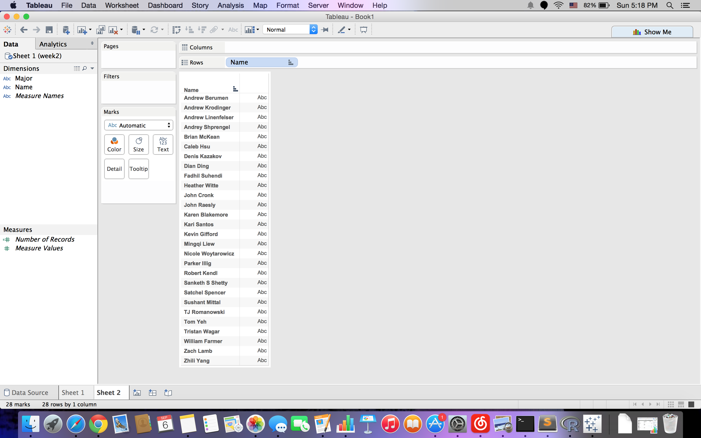
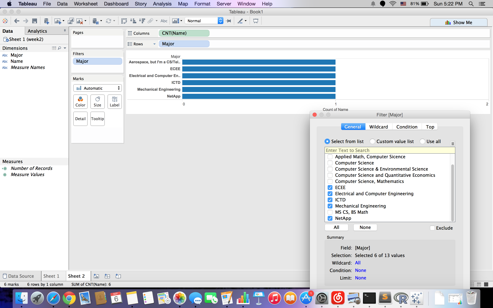
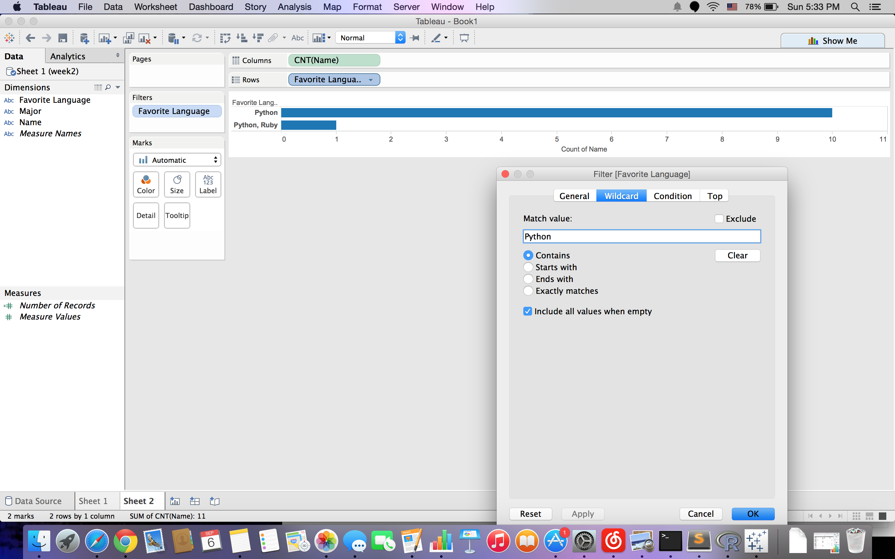

# Tableau Visualization

Tableau is arguably the biggest deal now in terms of data visualization for non-programmers.
Let's pretend you are not a programer. Learn and experience what it is like to make
visualizations using Tableau to answer the same questions about your classmates in our course.

For each of the question, think about what chart you should use to convey your answer and
make your best effort to create something that makes sense to you. There's no right
or wrong. When we meet in the class again, we will set aside time for each team to discuss
and compare the variety of visualization solutions each member has come up with for the
same set of questions. It will be fun!

To include a Tableau visualization in your report, take a screenshot, save it as an image,
put it in the `learning/week2` folder, and replace ``  with
your own image. Please makes sure your screenshot includes the _entire_ Tableau interface
including the controls, widgets ...etc.

# How big the deal Tableau really is?

(write your answer based on the statistics you can find online)

# How many students are Computer Science major?

There are 22 students are Computer Science major. I excluded the majors are not Computer Science in the chart, and only left the majors contain 'CS' or 'Computer Science'. The sum of all rows is the final result.

# How many students' names start with 'A'?

As we can see from the chart, four people's names start with 'A'. I used ascending sort for the chart, therefore, I can get the names I look for on the top of the chart.

# How many students are not Computer Science major?

Similar to the question 1, the only difference is I excluded the majors contain 'CS' or 'Computer Science'. The answer is 6.

# How many people's favorite programmging language is Python?

I used filter for the chart, and only leave the programming languages contain 'Python'. The answer is 11.
