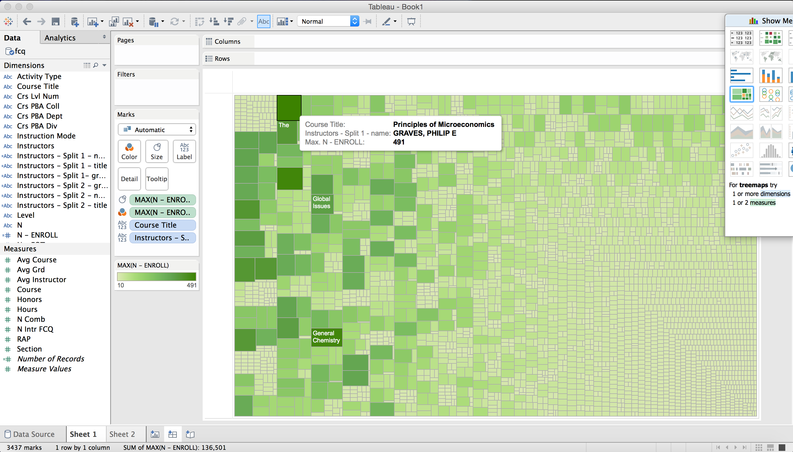
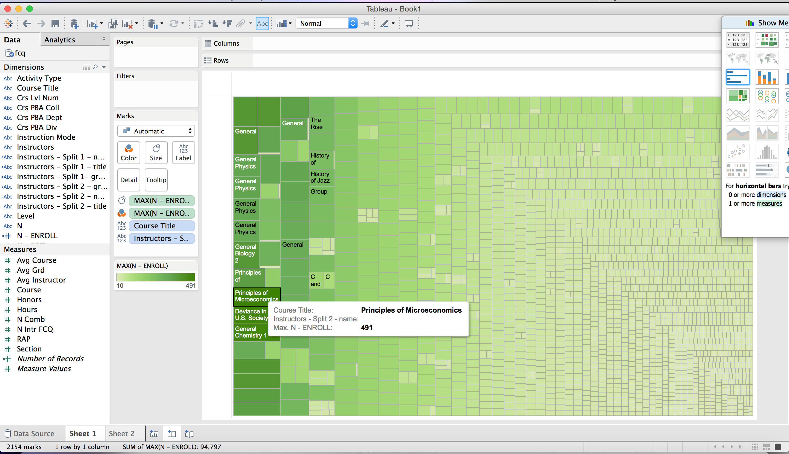
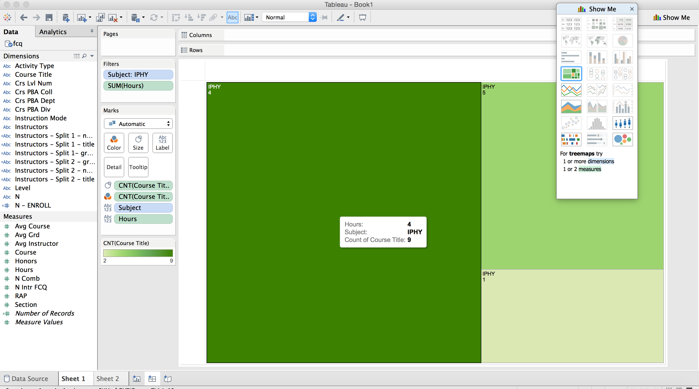
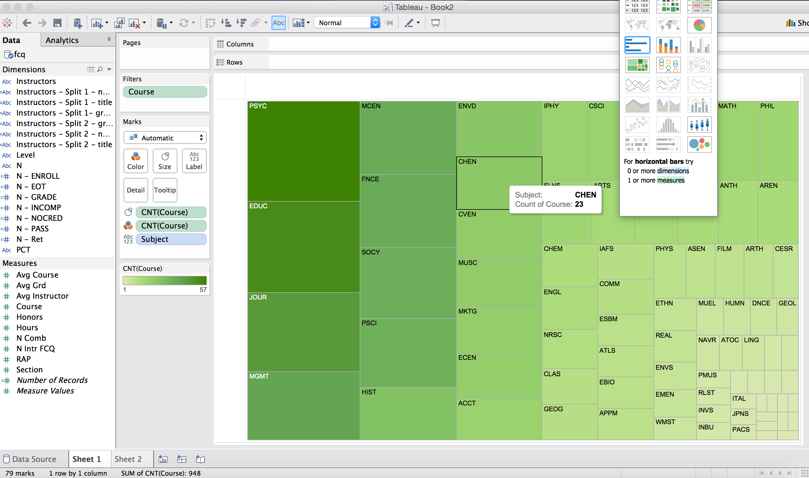
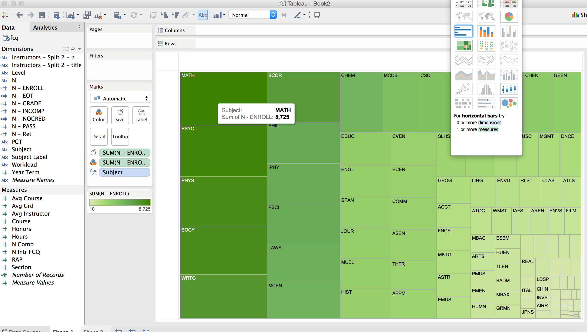
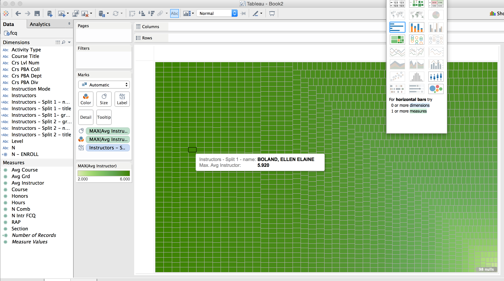

# Visualization

Using Tableau, create visualization for each question in the report. You will
work on this independently just like last week.

To include a Tableau visualization in your report, take a screenshot, save it as an image,
put it in the `learning/week2` folder, and replace ``  with
your own image. Please makes sure your screenshot includes the _entire_ Tableau interface
including the controls, widgets ...etc.

# Import

Data: [fcq.clean.json](https://github.com/bigdatahci2015/book/blob/master/hackathons/fcq/fcq.clean.json)

(a copy of this file is in your book repository already in the directory `hackathons/fcq`)

This dataset is provided to you in the JSON format. Your first task is to figure out
how to transform this JSON file into a format that can be fed into Tableau. As
a junior and senior, you are expected to be able to look around the Internet
to problem solve.

# Which instructor's course has the highest enrollment? by Zhili Yang

Because some courses contain more two instructors, I created two diagram for the question. The first diagram is for the frist instructor, the second one is for the second instructor. The enrollment for each course depends on how deep the color is. As we can see from the first picture, the maximum one is the course Principles of Microeconomics, and the professor is GRAVES, PHILIP E. And for the second one, the result is also Principles of Microeconomics, but there is no professor, the reason is there is only one professor for the course.

# (Question 2)# How many courses in IPHY that has 4 credits hours ? by Fadhil Suhendi

I used filter to get the courses are in the subject IPHY first, and then count the amounts of courses in each credits. As we can see from the picture, there are 9 courses are 4 credits.

# What departments offer the most 4000 level classess? By Brian

I used filter to get the courses with the level over 4000, and group them by Subject. The result is PSYC.

# Which department has the highest enrollment? By Tristan

As we can see from the diagram, MATH department has most enrollment.

# What instructors has the highest rating? By Andrew

For this question, there should be more than one instructors. In the report, we just chose HOBBS, STEVEN L whose raing is 6   
