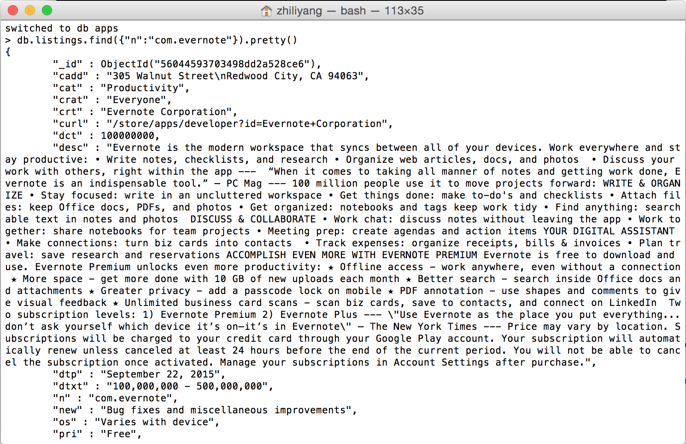

# Setup

The objective of this part of the learning challenge is to
download and install a Mongodb server running on your local machine and has the
server populated with the Android App listing detail data.

## Install

## Export Data

You can obtain data from an existing Mongodb server we've already setup. The information
about this server are provided below:

- host: ds041663.mongolab.com
- port: 41663
- user name: bigdatahci
- password: bigdatahci2015

Read the documentation to figure out what command to run in order to _dump_
all the data into a file: [mongodump](http://docs.mongodb.org/manual/reference/program/mongodump/).
This is a part of the challenge to see if you can rely on online documentation to
learn how to write appropraite database commands to do what you want.

This server has been configured to be read-only so you don't have to worry about
accidentally wiping the data off this server.

While the data is dumping, you should see something similar to this


## Import Data

Then, you can get this data into your own Mongodb server using the restore command.
Read the documentation to figure out what command to run: [mongorestore](http://docs.mongodb.org/manual/reference/program/mongorestore/).

While the data is being restored, you should see this


## Command-line Interface

Connect to Mongodb through the command line interface.

Issue a query:
```
    db.listings.find({"n":"com.evernote"}).pretty()
```
The goal is to be able to see something like below in the terminal.



(Replace this screenshot with a screenshot of each individual's own computer.
 Include the entire desktop in the screenshot so we can know this screenshot
 does belong to an individual)

 ## Data
 ## Example:
MongoDB documents are analogous to JSON objects. Below is an example of a document in our MongoDB collection.

```javascript
{
        "_id": "56044593703498dd2a528ce6",
        "cadd": "305 Walnut Street\nRedwood City, CA 94063",
        "cat": "Productivity",
        "crat": "Everyone",
        "crt": "Evernote Corporation",
        "curl": "/store/apps/developer?id=Evernote+Corporation",
        "dct": 100000000,
        "desc": "Evernote is the modern workspace that syncs between all of your devices. Work everywhere and stay productive: • Write notes, checklists, and research • Organize web articles, docs, and photos  • Discuss your work with others, right within the app ---  “When it comes to taking all manner of notes and getting work done, Evernote is an indispensable tool.” – PC Mag --- 100 million people use it to move projects forward: WRITE & ORGANIZE • Stay focused: write in an uncluttered workspace • Get things done: make to-do's and checklists • Attach files: keep Office docs, PDFs, and photos • Get organized: notebooks and tags keep work tidy • Find anything: searchable text in notes and photos  DISCUSS & COLLABORATE • Work chat: discuss notes without leaving the app • Work together: share notebooks for team projects • Meeting prep: create agendas and action items YOUR DIGITAL ASSISTANT • Make connections: turn biz cards into contacts  • Track expenses: organize receipts, bills & invoices • Plan travel: save research and reservations ACCOMPLISH EVEN MORE WITH EVERNOTE PREMIUM Evernote is free to download and use. Evernote Premium unlocks even more productivity: ★ Offline access - work anywhere, even without a connection ★ More space - get more done with 10 GB of new uploads each month ★ Better search - search inside Office docs and attachments ★ Greater privacy - add a passcode lock on mobile ★ PDF annotation - use shapes and comments to give visual feedback ★ Unlimited business card scans - scan biz cards, save to contacts, and connect on LinkedIn  Two subscription levels: 1) Evernote Premium 2) Evernote Plus --- \"Use Evernote as the place you put everything...don’t ask yourself which device it’s on—it’s in Evernote\" – The New York Times --- Price may vary by location. Subscriptions will be charged to your credit card through your Google Play account. Your subscription will automatically renew unless canceled at least 24 hours before the end of the current period. You will not be able to cancel the subscription once activated. Manage your subscriptions in Account Settings after purchase.",
        "dtp": "September 22, 2015",
        "dtxt": "100,000,000 - 500,000,000",
        "id": "com.evernote-5432",
        "n": "com.evernote",
        "new": "Bug fixes and miscellaneous improvements",
        "os": "Varies with device",
        "pri": "Free",
        "purl": "https://www.google.com/url?q=http://evernote.com/privacy/&sa=D&usg=AFQjCNHTyefT6GQ6A6mnOKPeqKUA_qjesg",
        "rate": 4.6,
        "rct": 1313925,
        "sz": "Varies with device",
        "t": "Evernote",
        "verc": "5432"
    }

```

## Collection Fields

MongoDB stores all field names in every document and this consumes disk space; hence, we use short field names.
The following table shows the short field names used in our MongoDB documents and their meanings.

|short name |  meaning                  |
|-----------|---------------------------|
| _id       | a unique field required in every MongoDB document |
| cadd      | creator address           |
| cat       | store category            |
| crat      | content rating            |
| crt       | creator/developer         |
| curl      | creator url               |
| dct       | minimum download count    |
| desc      | description               |
| dtp       | date published            |
| dtxt      | download range in text    |
| id        | app id                    |
| n         | app package name          |
| new       | what is new in this app version |
| os        | Android version           |
| pri       | price                     |
|purl       | privacy statement url     |
|rate       | star rating               |
|rct        | star rating count (How many users have rated this app)|
|sz         | app size                  |
|verc       | version code              |
